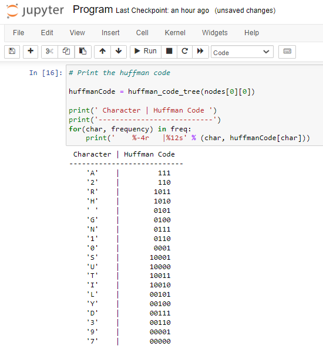

# HUFFMAN CODING
## AIM:
To implement Huffman coding to compress the data using Python.

## SOFTWARE REQUIRED:
Anaconda - Python 3.7

## ALGORITHM:
### Step1:
Get the input string.

### Step2:
Create the required tree nodes.

### Step3:
Function to implement the huffman coding.

### Step4:
Calculate frequency of occurence.

### Step5:
Print the characters and its huffman code.
## PROGRAM:
Developed by : Shrruthilaya G

Register number : 212221230097
### Get the input string:
```python
string = 'SHRRUTHILAYA GANGADARAN 212221230097'
```
### Create the tree nodes:
```python
class NodeTree(object):
    def __init__(self, left = None, right = None): 
        self.left = left
        self.right = right
        
    def children(self):
        return (self.left, self.right)
```

### Main function to implement huffman coding:
```python
def huffman_code_tree(node, left = True, binString = ''):
    if type(node) is str:
        return {node : binString}
    (l, r) = node.children()
    d = dict()
    d.update(huffman_code_tree(l, True, binString + '0'))
    d.update(huffman_code_tree(r, False, binString + '1'))
    return d
```
### Calculate the frequency of occurrence:
```python
freq = {}
for c in string:
    if c in freq:
        freq[c] += 1
    else:
        freq[c] = 1
        
freq = sorted(freq.items(), key = lambda x : x[1], reverse = True)

nodes = freq
```
```python
while len(nodes) > 1:
    (key1, c1) = nodes[-1]
    (key2, c2) = nodes[-2]
    nodes = nodes[:-2]
    node = NodeTree(key1, key2)
    nodes.append((node, c1 + c2))
    
    nodes = sorted(nodes, key = lambda x : x[1], reverse = True)
```

### Print the characters and it's huffman code:
```python
huffmanCode = huffman_code_tree(nodes[0][0])

print(' Character | Huffman Code ')
print('---------------------------')
for(char, frequency) in freq:
    print('    %-4r   |%12s' % (char, huffmanCode[char]))
```
## OUTPUT:
### Characters and it's huffman code:



## RESULT:
Thus, the huffman coding was implemented to compress the data using python programming.